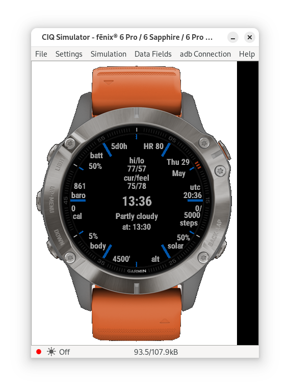

Simple watch face for myself, targeted only at the phenix 6 pro soloar

Shows a bunch of info arrayed around the edges of the watch, as well as along the center line.
Background is pips where hour markers would be present on an analog watch.

- Time
  - local time in 24hr format (HH:MM) in center
  - UTC time in 24hr format (2:30 position)
  - Date (local, 1:30 position)
- Health
  - Heart rate at the 12:30 location
  - steps at the 3:30 location
  - Body Battery at the 7:30 location
  - Daily calories burned at 8:30
- Watch Battery 
  - percentage at 10:30
  - time remaining at 11:30
  - solar % at 4:30
- Weather
  - Altitude at 6:30 (text at 5:30)
  - barometric pressure at 9:30
  - weather conditions for current location along center line, above/below time
    - daily high/low (top)
    - current and feels like temperature (second)
    - current weather (e.g. clear, cloudy, etc.) under local time
    - time of weather source (to show if info is current).

Notes:
- Weather information is sourced based on current location from the garmin connect app, which can be configured to use a static location or the phone's current location.
- Expected watch face from the simulated watch:
  - 

